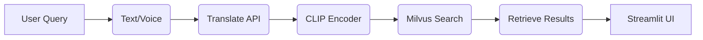

# Hệ thống Tìm kiếm Đa phương tiện Ngữ nghĩa Tiếng Việt (Vietnamese Semantic Multimedia Search System)

###  HTTA Legends – AI Challenge 2025

> “Chỉ sống một lần, hãy sống sao không hối tiếc.”

-----

##  Giới Thiệu Chung

**Tên đội:** HTTA Legends
**Cuộc thi:** [AI Challenge 2025 – Thành phố Hồ Chí Minh](https://aichallenge.hochiminhcity.gov.vn/)

### Nhiệm vụ

Phát triển **Hệ thống tìm kiếm đa phương tiện ngữ nghĩa tiếng Việt** (Semantic Multimedia Search System), cho phép người dùng **tìm ảnh, video, audio** bằng **ngôn ngữ tự nhiên** (text/voice).

Hệ thống được tối ưu cho **CLIP + Milvus**, triển khai thực tế trên **Google Cloud (Ubuntu Linux)**.

###  Thành viên

Trưởng nhóm: Vỏ Văn Tài
- Thành viên:

   - Huỳnh Chí Phi Thuận
   - Phan Nguyễn Vũ Huy
   - Nguyễn Hoàng Ân

-----

##  Mục Tiêu Dự Án

1.  **Phát triển MVP hoàn chỉnh** gồm 3 module:
      *  **Trợ lý ảo điều phối**: Hiểu truy vấn tiếng Việt, gợi ý thêm ngữ cảnh.
      *  **Tìm kiếm đa phương tiện**: Sử dụng **CLIP + Milvus** cho semantic search.
      *  **Giao diện người dùng**: Cho phép nhập truy vấn text/voice, hiển thị kết quả multimedia.
2.  **Dữ liệu Demo:** Sử dụng kho ảnh, video, audio có nhãn ngữ nghĩa. Metadata được quản lý bằng `metadata.json` hoặc `index.pkl`.
3.  **Demo Hoàn Chỉnh:** Giao diện **Streamlit** trực quan, phản hồi nhanh, cùng với báo cáo kỹ thuật và hướng dẫn triển khai trên Cloud.

-----

##  Kiến Trúc Hệ Thống

###  Quy trình Tổng quan



###  Quy trình Chính

1.  **Xử lý dữ liệu video:**
      * Tách *keyframes* bằng OpenCV.
      * Sinh embedding (**CLIP/BLIP-2**) cho ảnh/video/audio.
      * Lưu vector vào **Milvus**, metadata vào **PostgreSQL**.
2.  **Xử lý truy vấn:**
      * Người dùng nhập text hoặc ảnh → **CLIP encoder** → vector embedding.
      * **Milvus** tìm Top-K kết quả gần nhất (cosine similarity).
3.  **Hiển thị kết quả:**
      * **Streamlit** hiển thị multimedia + metadata.
      * Cho phép lọc lại kết quả (theo tag, loại media, độ tương đồng).

-----

##  Công Nghệ Chính

| Thành phần | Công cụ / Framework | Mô tả |
| :--- | :--- | :--- |
| **Vector DB** | Milvus v2.4.1 | Lưu trữ & truy vấn embedding hiệu suất cao |
| **Embedding Model** | CLIP | Sinh vector text + ảnh đa năng |
| **Ngôn ngữ & NLP** | Google Translate API, VnCoreNLP | Chuẩn hóa và dịch truy vấn tiếng Việt |
| **Frontend ** | Streamlit | Giao diện người dùng |
| **Database** | PostgreSQL 15 | Lưu trữ metadata chi tiết |
| **Containerization** | Docker + Docker Compose | Đóng gói môi trường phát triển |
| **Cloud Hosting** | Google Cloud (GCP) | Triển khai thực tế trên VM Ubuntu 25.04 |

-----

##  Hạ tầng Cloud (GCP)

**Nền tảng:** Google Cloud Compute Engine

**Cấu hình VM:**

  * 8 vCPU Intel® Xeon®
  * 32GB RAM
  * 250GB SSD (chạy hệ thống)
  * 280GB HDD (lưu dữ liệu media + embedding)
  * OS: Ubuntu 25.04 (Kernel 6.14.0-gcp)

-----

##  Thiết Lập Môi Trường

###  Cài Đặt Cơ Bản (Linux CLI)

```bash
# Cập nhật & cài đặt cơ bản
sudo apt update && sudo apt upgrade -y
sudo apt install docker.io docker-compose python3-venv git -y
```

###  Phân Quyền Người Dùng Linux

```bash
# Tạo user riêng cho từng thành viên
sudo adduser thuan
sudo adduser huy
sudo adduser an

# Phân quyền thư mục project + data
sudo mkdir -p /home/ubuntu/AI_CHALLENGE_HTTA/data/{batch1,batch2}
sudo chown -R tai:htta /home/ubuntu/AI_CHALLENGE_HTTA

# Thêm quyền Docker cho các thành viên
sudo usermod -aG docker thuan
sudo usermod -aG docker huy
sudo usermod -aG docker an
```

-----

##  Cấu Trúc Thư Mục

```
AI_CHALLENGE_HTTA/
│
├── app_code/
│   ├── __init__.py
│   ├── config.py              # Đọc ENV (Postgres, Milvus, GCP)
│   ├── helpers.py             # Hàm tiện ích chung
│   ├── load_data.ipynb        # Chuẩn bị dữ liệu embedding
│   ├── search.py              # Logic tìm kiếm vector
│   └── create_postgres.ipynb  # Tạo bảng & import metadata
│
├── app.py                     # Main Streamlit app
├── docker-compose.yml         # Container Milvus + PostgreSQL
├── requirements.txt           # Thư viện Python
├── README.md                  # Mô tả dự án
├── note_to_run_app.txt        # Ghi chú kỹ thuật
├── venv/                      # Virtual environment
└── data/                      # Lưu embedding & media
```

-----

##  Hướng Dẫn Chạy Hệ Thống

Thực hiện các lệnh sau trong môi trường Linux CLI:

```bash
# 1. Clone repo
git clone https://github.com/HTTA-Legends/AI_CHALLENGE_HTTA.git
cd AI_CHALLENGE_HTTA

# 2. Tạo môi trường ảo
python3 -m venv venv
source venv/bin/activate

# 3. Cài thư viện Python
pip install -r requirements.txt

# 4. Khởi chạy Docker services (Milvus + PostgreSQL)
docker-compose up -d

# 5. Chạy giao diện web Streamlit
streamlit run app.py
```


-----

##  Phân công & Vai trò

| Thành viên | Vai trò | Nhiệm vụ | Kỹ năng chính |
| :--- | :--- | :--- | :--- |
| **Vỏ Văn Tài** | Leader / Data Engineer | Thiết lập GCP, tối ưu pipeline, tích hợp CLIP + Milvus, build UI | Docker, Python, Streamlit, Milvus |
| **Nguyễn Hoàng Ân** | NLP Engineer | Xử lý tiếng Việt, dịch và chuẩn hóa truy vấn | HuggingFace, VnCoreNLP |
| **Phan Nguyễn Vũ Huy** | Vision Engineer | Tìm kiếm ảnh/video/audio, tối ưu CLIP embedding | PyTorch, OpenCV |
| **Huỳnh Chí Phi Thuận** | Backend Engineer | Xây dựng metadata DB, quản lý upload vector,tích hợp CLIP + Milvus | PostgreSQL, Docker,Milvus |

-----

##  Điểm Nổi Bật Của Dự Án

  * **CLIP + Milvus:** Đảm bảo Semantic Search cho ảnh/video/audio với độ chính xác cao.
  * **Triển khai Thật:** Hệ thống được triển khai và tối ưu trên **Google Cloud Linux**.
  * **Hệ thống Docker hóa:** Dễ dàng mở rộng và tái tạo môi trường làm việc.
  * **Tích hợp NLP:** Xử lý tiếng Việt (VnCoreNLP) và dịch tự động (Google Translate API) cho truy vấn ngôn ngữ tự nhiên.

-----

##  Kỹ Năng Nhóm Học Được

| Nhóm Kỹ Năng | Mô tả Chi tiết |
| :--- | :--- |
| **AI/ML Systems** | CLIP, BLIP-2, Semantic Search, xây dựng RAG pipeline |
| **Data Engineering** | Thiết kế Metadata schema, tích hợp PostgreSQL |
| **DevOps & Cloud** | Thiết lập GCP, Docker Compose, quản lý Linux permissions |
| **Web & Visualization** | Xây dựng giao diện Streamlit UI, tích hợp API, hiển thị kết quả multimedia |
| **Collaboration** | Quy trình làm việc GitHub, SSH multi-user, teamwork hiệu quả |

-----

##  Tài Liệu Tham Khảo

  * [AI Challenge 2025 – Website chính thức](https://aichallenge.hochiminhcity.gov.vn/)
  * [Video Browser Showdown 2024 Systems](https://videobrowsershowdown.org/teams/vbs2024-systems/)
  * [CLIP Model – HuggingFace](https://huggingface.co/docs/transformers/model_doc/clip)
  * [RAG Architecture – CSC Vietnam](https://csc.edu.vn/tin-tuc/Blog-chia-se/kham-pha-rag-huong-dan-xay-dung-chatbot-voi-rag-8433)
  * [Vector DB Comparison – RealPython](https://realpython.com/chromadb-vector-database/)
  * Radford, A. *et al.* (2021). *Learning Transferable Visual Models From Natural Language Supervision (CLIP)*.
  * Li, J. *et al.* (2023). *BLIP-2: Bootstrapping Language-Image Pre-training*.
  * Milvus Team. (2022). *Vector Database for AI Applications.*
  * Nguyen, H. *et al.* (2020). *VnCoreNLP: A Vietnamese NLP Toolkit.*

-----

##  Demo & Liên Hệ

 **Video demo:** [YouTube link (upcoming)](https://youtu.be/nWbh9e9vTbM?si=jOq59J9d6hua1yfR)

 **Liên hệ Trưởng nhóm:** **Vỏ Văn Tài** – *Data Engineer / AI Developer*

  * Email: **vovantai2k4@gmail.com**
  * GitHub: [HTTA-Legends](https://www.google.com/search?q=https://github.com/HTTA-Legends/AI_CHALLENGE_HTTA)
